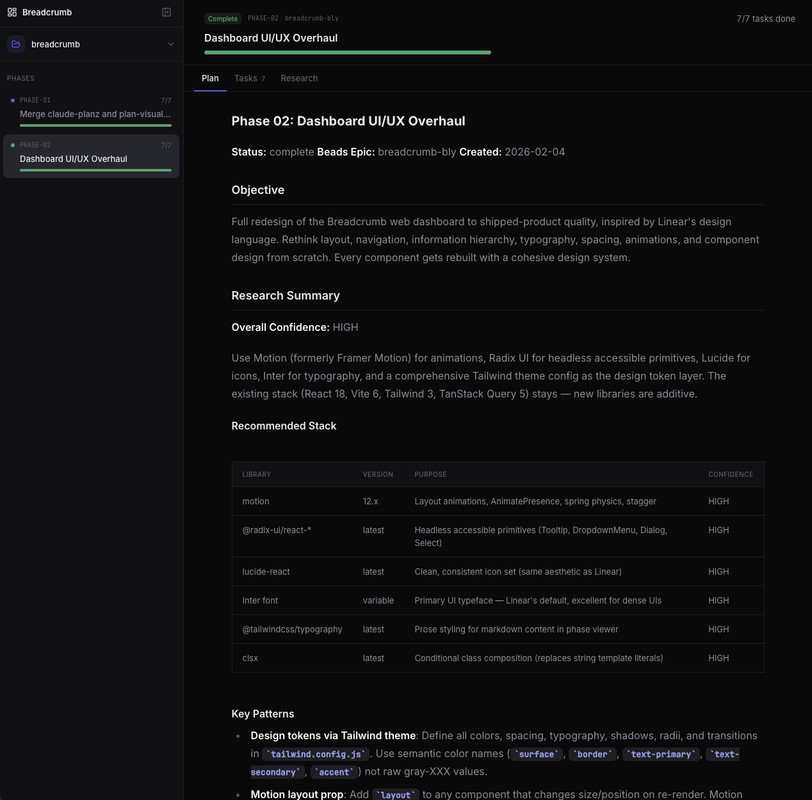
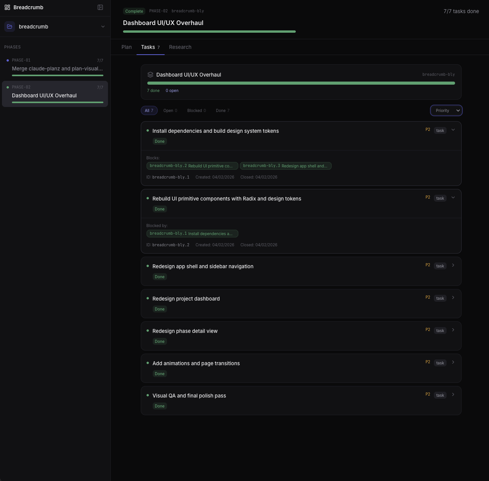

# Breadcrumb

Phase-based planning and visualization for [Claude Code](https://docs.anthropic.com/en/docs/claude-code) projects.

Breadcrumb gives you `/bc:*` slash commands for structured project planning inside Claude Code, a [Beads CLI](https://github.com/steveyegge/beads) integration for task tracking, and a local web UI that visualizes your phases, tasks, and research in real time.

| Phase Plan View | Task Tracking View |
|---|---|
|  |  |

## Features

- **Phase-based workflow** — Break projects into phases, plan them with research, execute tasks, and track progress
- **Web UI dashboard** — Dark-themed local web app showing phases, tasks, and research documents per project
- **Multi-project support** — One daemon serves all your projects; switch between them in the UI
- **Real-time updates** — File changes in `.planning/` and `.beads/` are broadcast instantly via SSE
- **Beads integration** — Task tracking backed by Beads CLI with SQLite-based issue management
- **Research agents** — Dedicated research subagent for deep-diving on tasks before implementation

## Install

### Prerequisites

- [Node.js](https://nodejs.org) v18+
- [Claude Code](https://docs.anthropic.com/en/docs/claude-code)
- git

### macOS / Linux / WSL

```bash
curl -fsSL https://raw.githubusercontent.com/fuseboxhq/breadcrumb/main/install.sh | bash
```

### Windows (PowerShell)

```powershell
irm https://raw.githubusercontent.com/fuseboxhq/breadcrumb/main/install.ps1 | iex
```

The installer will:
1. Install [Beads CLI](https://github.com/steveyegge/beads) if not present
2. Download `/bc:*` commands, agent, and skill to `~/.claude/`
3. Clone and build the Breadcrumb server to `~/.breadcrumb/server/`
4. Optionally configure `bread.crumb` hostname
5. Start the Breadcrumb daemon

## Getting Started

After installation, open Claude Code in any project and run:

```
/bc:init
```

This sets up git (if needed), initializes Beads with hooks and merge driver, creates `.planning/` directories, makes an initial commit, starts the daemon, and registers the project with the web UI.

### Typical workflow

```
/bc:new-phase "Add user authentication"   # Create a phase
/bc:plan PHASE-01                          # Research and plan it
/bc:execute PHASE-01                       # Execute all tasks
/bc:status                                 # Check progress
/bc:close-phase PHASE-01                   # Mark complete
```

## Commands

| Command | Description |
|---------|-------------|
| `/bc:init` | Initialize git, Beads, and Breadcrumb in a project |
| `/bc:integrate` | Explore codebase and create CODEBASE.md context |
| `/bc:new-phase <title>` | Create a new phase |
| `/bc:plan PHASE-XX` | Research, clarify, and plan a phase |
| `/bc:execute <id\|PHASE-XX>` | Execute a task or all tasks in a phase |
| `/bc:discuss-task <task-id>` | Clarify a task's requirements before implementation |
| `/bc:research <task-id>` | Deep research on a specific task |
| `/bc:status` | Show phase progress and ready tasks |
| `/bc:close-phase PHASE-XX` | Mark a phase complete |
| `/bc:todo <description>` | Add an item to the todo list |
| `/bc:todos` | View and manage the todo list |
| `/bc:update` | Update Breadcrumb to the latest version |
| `/bc:quick <description>` | Quick task execution without full planning |
| `/bc:doctor` | Diagnose and repair Breadcrumb + Beads setup issues |

## Web UI

The Breadcrumb daemon runs on `localhost:9999` and serves a Linear-inspired dark-themed dashboard:

- **Collapsible sidebar** — Phase list with status dots, ready-task badges, and progress bars; collapses to icon-only mode (persisted via localStorage)
- **Project switcher** — Radix dropdown in the sidebar header for switching between registered projects
- **Project dashboard** — Status card, phase progress grid with hover interactions, and ready tasks panel
- **Phase detail view** — Tabbed interface (Plan / Tasks / Research) with animated tab indicator, markdown rendering, task cards with dependency pills, and filter/sort controls
- **Animations** — Page transitions, tab content slides, staggered list entrances, and hover micro-interactions via Motion

### Daemon management

```bash
# From the server directory (~/.breadcrumb/server/)
pnpm daemon:start    # Start the daemon
pnpm daemon:stop     # Stop the daemon
pnpm daemon:status   # Check daemon status
```

### Optional: bread.crumb hostname

Access the UI at `http://bread.crumb` instead of `http://localhost:9999`:

**macOS / Linux:**
```bash
sudo bash ~/.breadcrumb/server/scripts/setup-hostname.sh
```

**Windows (Administrator PowerShell):**
```powershell
& "$env:USERPROFILE\.breadcrumb\server\scripts\setup-hostname.ps1"
```

## Hooks & Statusline

`/bc:init` configures Claude Code hooks in `~/.claude/settings.json` for live status and CLI safety.

### Statusline

Shows current phase, task progress, active work, and context window in Claude Code's status bar:

```
PHASE-01 ▸ 3/7 │ Implementing auth │ myproject │ ████░░░░░░ 57%
```

| Segment | Source |
|---------|--------|
| Phase + progress | `.planning/STATE.md` + daemon cache |
| Current task | Claude Code todos (in-progress task) |
| Project name | Working directory |
| Context bar | Remaining context window (green → yellow → orange → red) |

### Hooks

| Hook | Type | Purpose |
|------|------|---------|
| `bc-statusline.cjs` | statusLine | Live phase/progress/context display |
| `bc-session-start.cjs` | SessionStart | Warm cache, start daemon, check for updates |
| `bc-session-end.cjs` | Stop | Run `bd sync` to flush Beads state |
| `bc-bash-guard.cjs` | PreToolUse | Catch `bd` CLI mistakes (e.g., `--status in-progress` → `in_progress`) |

### Pre-approved permissions

`/bc:init` also adds permission rules so Claude doesn't prompt for common read-only commands:

- **Beads CLI**: `bd *`
- **Search**: `grep`, `find`, `wc`, `which`, `file`, `du`, `stat`
- **Git reads**: `git status`, `git log`, `git diff`, `git branch`, `git show`, `git remote`
- **Build tools**: `pnpm`, `npm`, `node`, `npx`, `tsc`
- **System**: `ls`, `pwd`, `env`, `uname`, `curl`

## Architecture

```
~/.claude/
  commands/bc/         # /bc:* slash commands
  agents/              # bc-researcher agent
  skills/breadcrumb/   # Background skill context

~/.breadcrumb/
  server/              # Breadcrumb server (cloned repo)
  hooks/               # Claude Code hook scripts
  cache/               # Statusline and update cache
  projects.json        # Multi-project registry
  daemon.pid           # Daemon PID file
  install-path         # Server install location

your-project/
  .planning/
    STATE.md           # Project state tracking
    PHASE-01.md        # Phase documents
    research/          # Research documents
  .beads/
    beads.db           # Beads SQLite database
```

### Tech stack

- **Frontend**: React 18, Vite 6, Tailwind CSS 3 (semantic design tokens), TanStack Query 5
- **UI**: Radix UI (Tooltip, DropdownMenu, Dialog, Select), Lucide icons, Inter + JetBrains Mono fonts, clsx
- **Animation**: Motion (formerly Framer Motion) — AnimatePresence, layout animations, spring physics
- **Backend**: Express 4, better-sqlite3, chokidar 5
- **Runtime**: Node.js 18+, tsx, pnpm

## Development

```bash
git clone https://github.com/fuseboxhq/breadcrumb.git
cd breadcrumb
pnpm install
pnpm dev
```

This starts both the Express API server (port 9998) and Vite dev server (port 9999) with hot reload.

## Updating

```
/bc:update
```

Or manually:

```bash
curl -fsSL https://raw.githubusercontent.com/fuseboxhq/breadcrumb/main/install.sh | bash
```

## License

MIT
